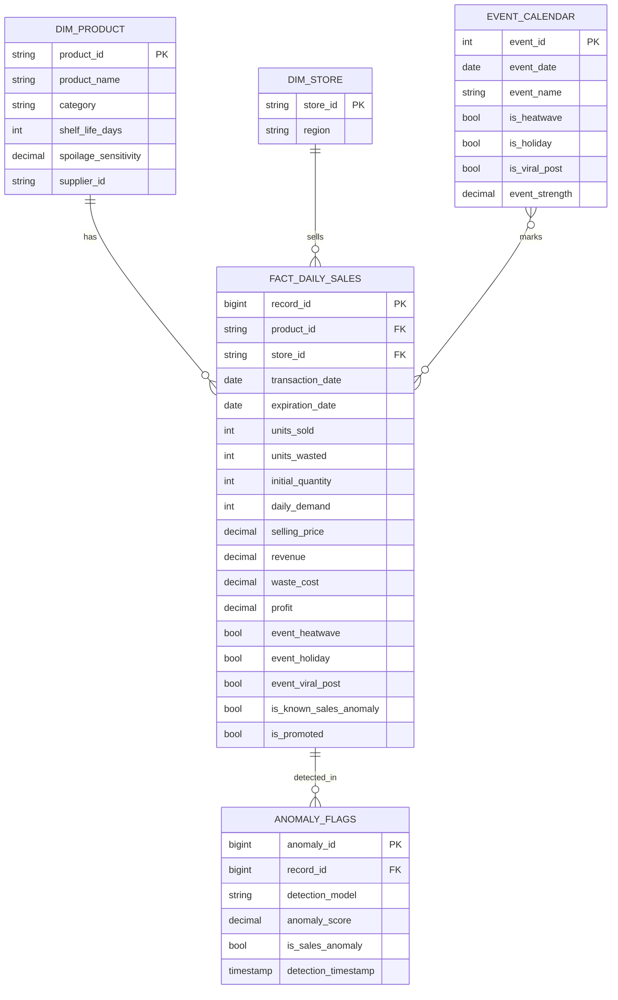

# FoodFox Extended Data Model (ER Diagram)

```mermaid
erDiagram
    DIM_PRODUCT ||--o{ FACT_DAILY_SALES : has
    DIM_STORE ||--o{ FACT_DAILY_SALES : sells
    FACT_DAILY_SALES ||--o{ ANOMALY_FLAGS : detected_in
    EVENT_CALENDAR o{--o{ FACT_DAILY_SALES : marks

    DIM_PRODUCT {
      string product_id PK
      string product_name
      string category
      int shelf_life_days
      decimal spoilage_sensitivity
      string supplier_id
    }

    DIM_STORE {
      string store_id PK
      string region
    }

    EVENT_CALENDAR {
      int event_id PK
      date event_date
      string event_name
      bool is_heatwave
      bool is_holiday
      bool is_viral_post
      decimal event_strength
    }

    FACT_DAILY_SALES {
      bigint record_id PK
      string product_id FK
      string store_id FK
      date transaction_date
      date expiration_date
      int units_sold
      int units_wasted
      int initial_quantity
      int daily_demand
      decimal selling_price
      decimal revenue
      decimal waste_cost
      decimal profit
      bool event_heatwave
      bool event_holiday
      bool event_viral_post
      bool is_known_sales_anomaly
      bool is_promoted
    }

    ANOMALY_FLAGS {
      bigint anomaly_id PK
      bigint record_id FK
      string detection_model
      decimal anomaly_score
      bool is_sales_anomaly
      timestamp detection_timestamp
    }
```
